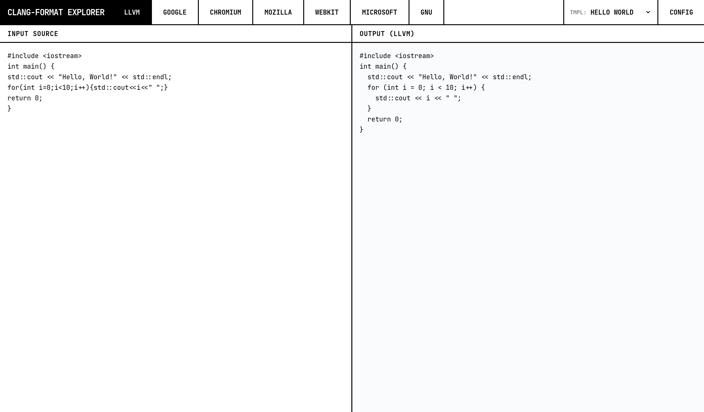

# Clang Format Explorer



quickly experiment between different [clang-format](https://clang.llvm.org/docs/ClangFormat.html) configurations. Generated with [AI Studio app](https://aistudio.google.com/apps).

## Usage

requires [Deno 2.x](https://deno.land/).

```sh
deno task dev
```

## License

[AGPL-3.0-only](./LICENSE)
